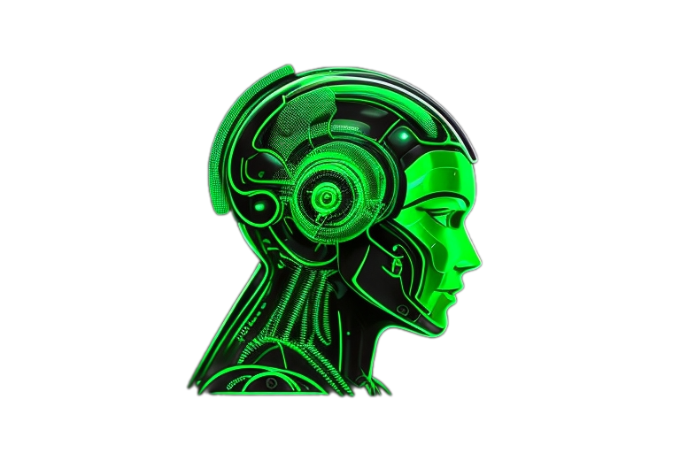

## About

Chat GPT App built on flutter.

## Documentation

**Features:**
- Chat with ChatGPT, the user enters a query and receives a response from the neural network.
- Saving the history of user requests and responses in the phone memory.
- Ability to clear Chat history.
- Application splash screen with logo.

**Stack:**
- Visual Studio Code, Flutter/Dart. 

**Packages:** 
- dash_chat_2, chat_gpt_sdk, flutter_native_splash, shared_preferences

## Application show:

